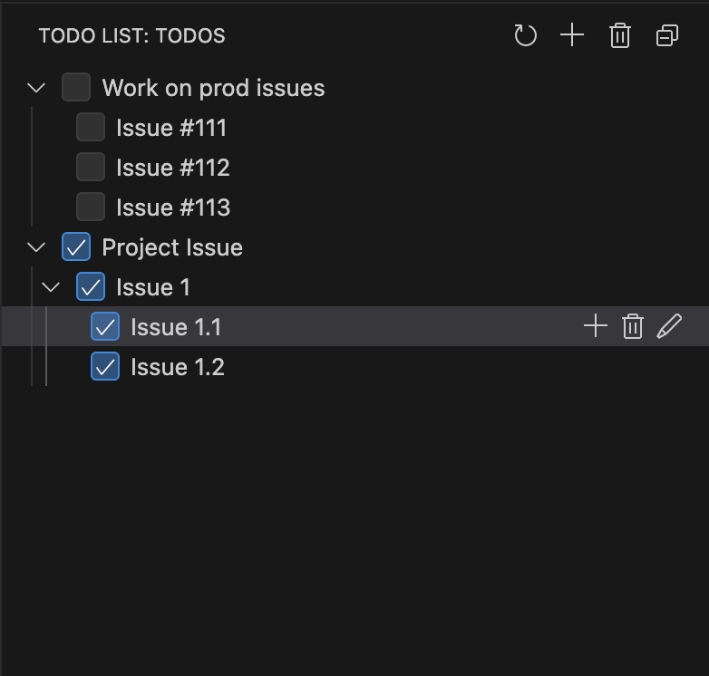

# SimplyTodo

`SimplyTodo` is a straightforward and easy-to-use todo list manager right inside your Visual Studio Code editor. Keep track of your todos without ever leaving your workspace.

## Features

Here are the features for `SimplyTodo`:

- **Display to do in tree hierarchy**: To-do todos and their sub-todoa are in tree hierarchy.
- **Add a new todo item**: Quickly add a new todo to your list.
- **List all todo items**: View all your pending todos.
- **Mark a todo as complete**: Check off items as you finish them.
- **Remove a todo item**: Clean up your list by removing todos.
- **Remove all checked item**: Clean up your list by removing completed todos.

## Requirements

There are no external requirements or dependencies for this extension.

## How to Use

1.  Open the Command Palette (`Ctrl+Shift+P` on Windows/Linux or `Cmd+Shift+P` on macOS).
2.  Type `Todo:` to see all available commands.
3.  Select one of the commands to manage your todo list.

## Extension Settings

This extension does not contribute any VS Code settings at the moment.
